```{r setup, include=FALSE}
knitr::opts_chunk$set(echo = FALSE)
```


## Total count by gender
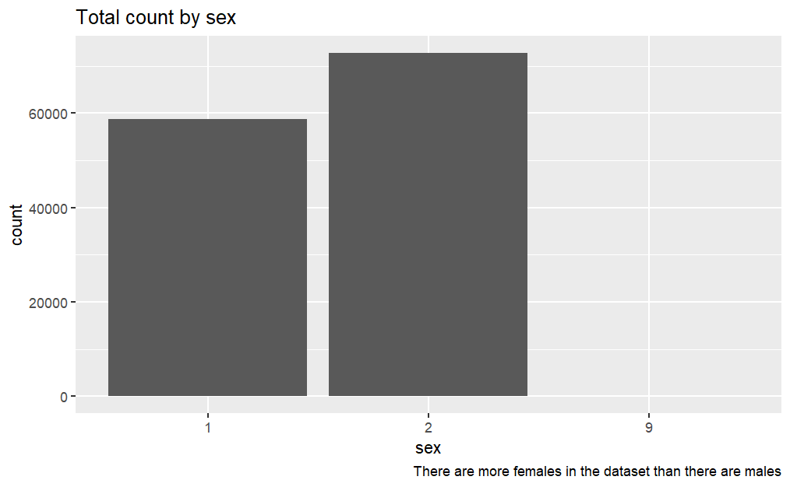

## Average Age by Month of Admission 
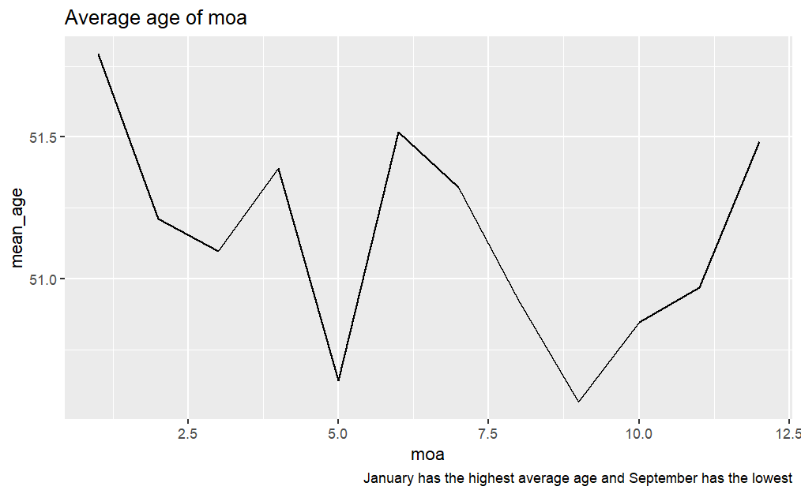

## Average Age by Gender by Month of Addmission 
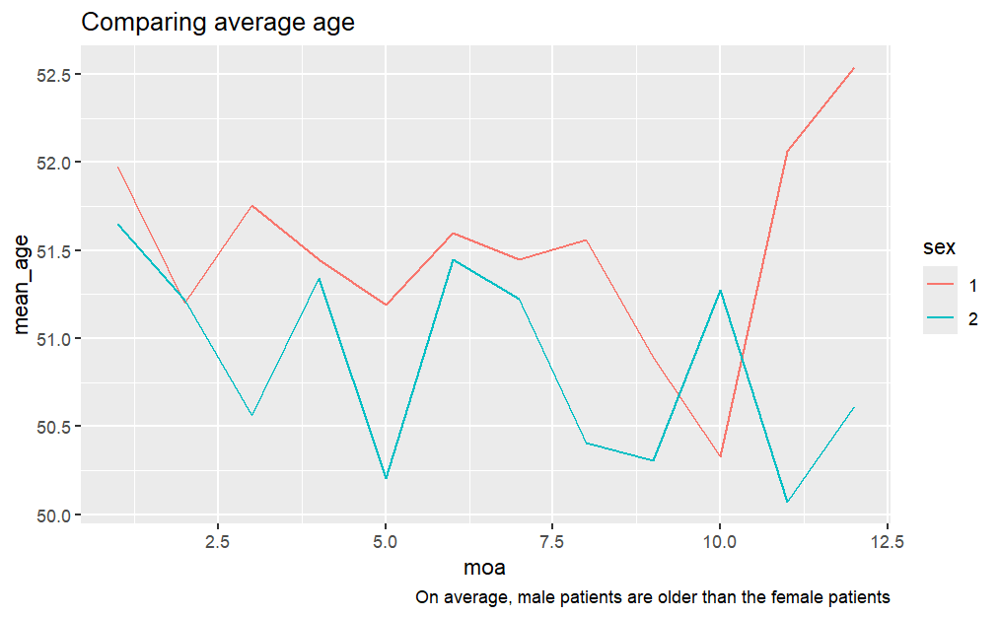

## LOS by Admtype
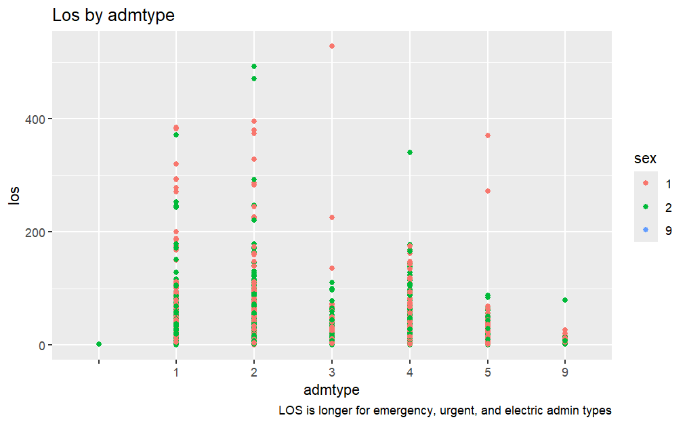

## Total charge by provider
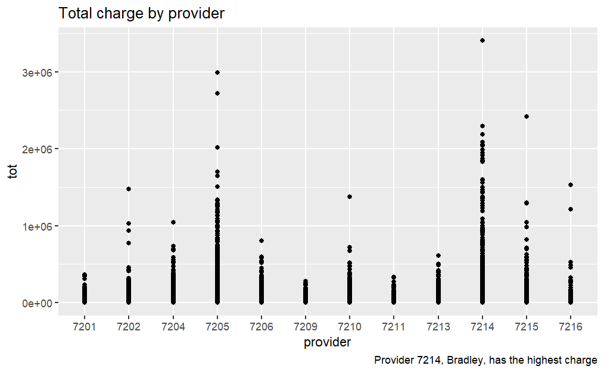

## Relationship Between Age and Total Charges
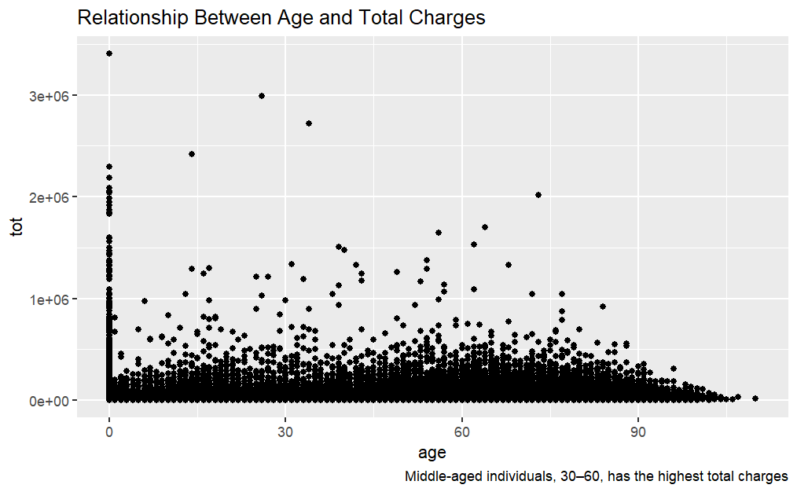

## Total charges by gender
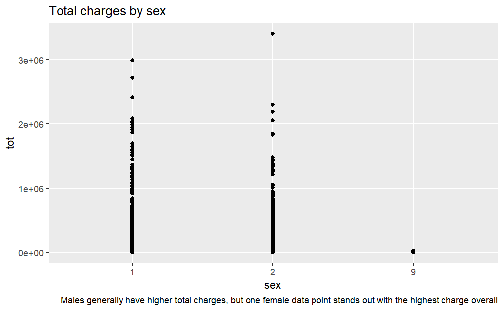

## Total LOS by age 
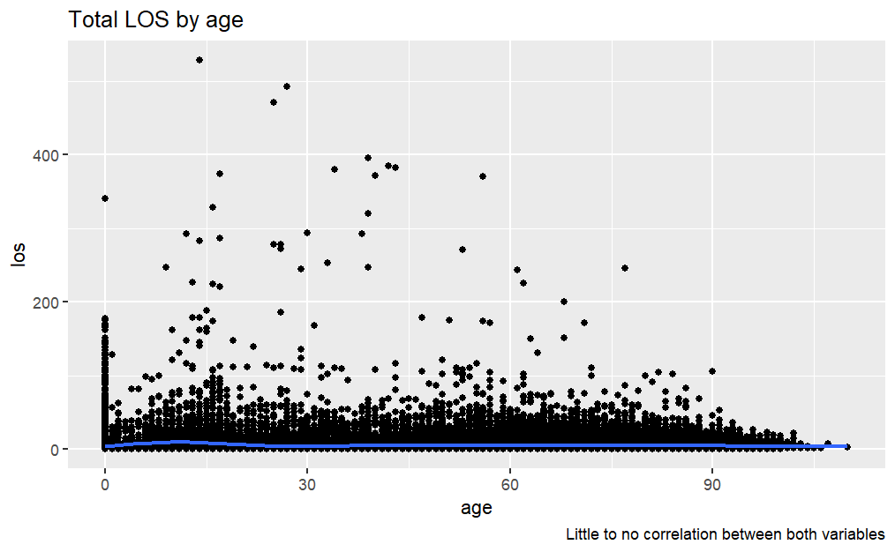

## Total LOS by gender
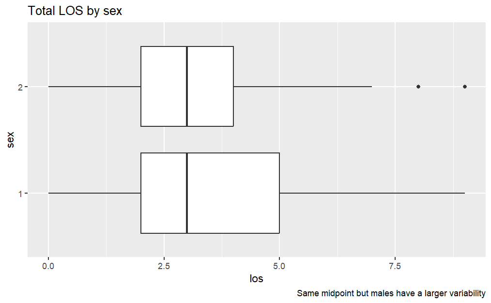

## Provider total charge by month
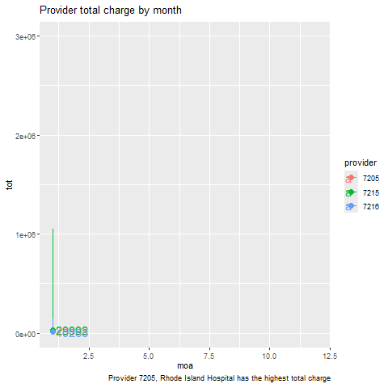


## Comparison of the models 
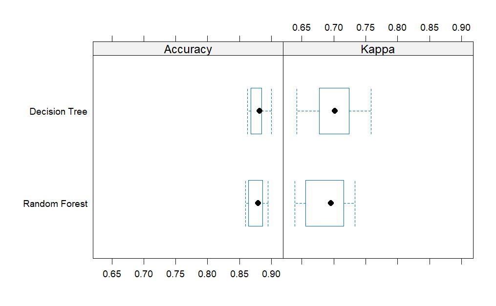

## Final Selection 
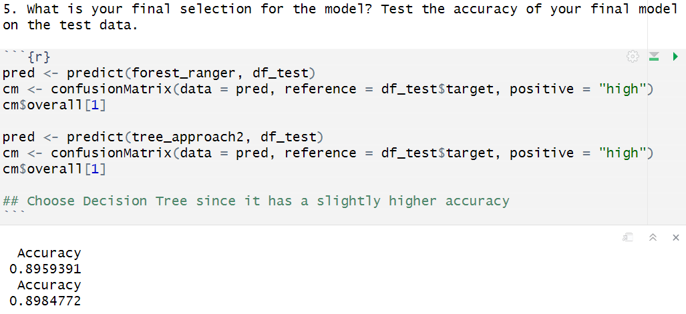

## Target set as sex 
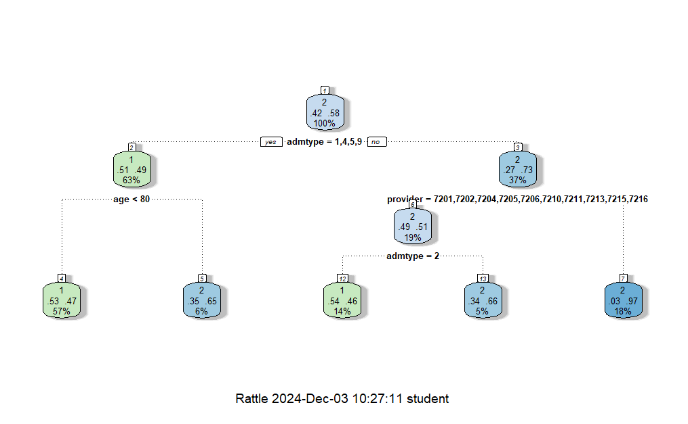
## Tree approach 
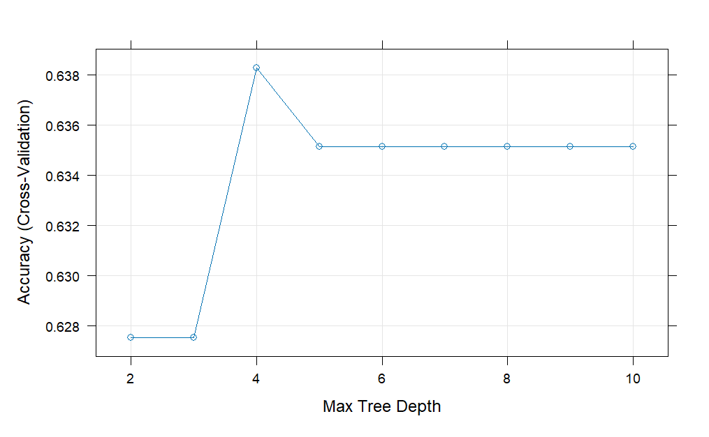


## Forest ranger using 'ranger'
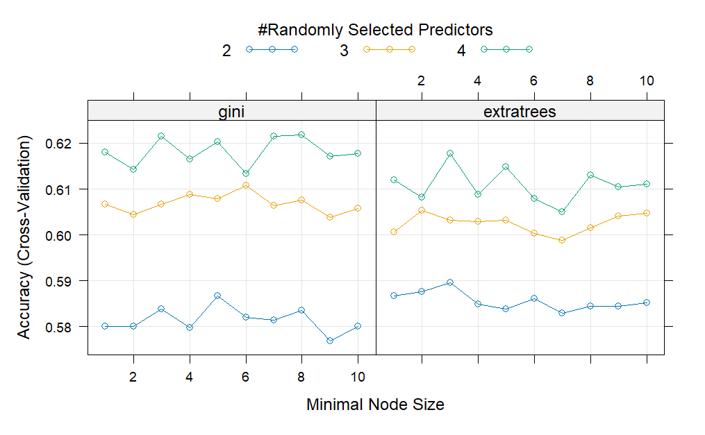

## Comparing
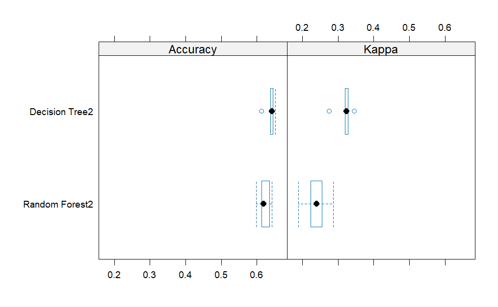


