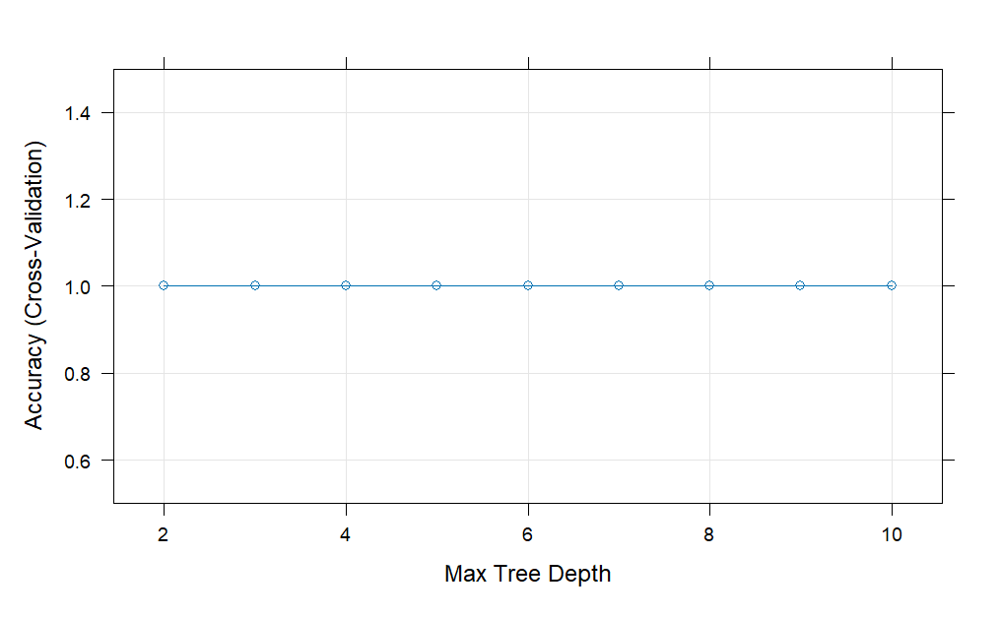

```{r setup, include=FALSE}
knitr::opts_chunk$set(echo = FALSE)
```


## Total count by gender


## Average Age by Month of Admission 


## Average Age by Gender by Month of Addmission 


## LOS by Admtype


## Total charge by provider


## Relationship Between Age and Total Charges


## Total charges by gender


## Total LOS by age 


## Total LOS by gender


## Provider total charge by month


## Summary
- Females outnumber males and show greater age variance, males typically incur higher total charges, though an exceptional case among females stands out 
- Middle-aged individuals drive the highest costs, yet the weak correlation between age and LOS suggests that factors beyond age significantly influence hospital stays. Provider charges also vary widely, with Rhode Island Hospital leading consistently
- Overall, the data points to predictable trends in some areas but significant variability and outliers in others, suggesting the need for a closer look at specific drivers of cost and care.


## Comparison of the models 


## Final Selection 


## Target set as sex 

## Tree approach 



## Forest ranger using 'ranger'


## Comparing


## Summary
- The forest model turned out to be more accurate than the decision tree for the df dataset, which makes sense since forests are better at handling complex patterns. 
- For the dfa dataset, both models scored a perfect accuracy of 1. Great at first, but it’s probably a sign of overfitting—basically, the models might be memorizing the data instead of learning how to handle new data. 
- Increasing the maximum tree depth boosted accuracy, likely because deeper trees can make more specific splits and pick up on finer details.
- It’s a trade-off since deeper trees and forests are more prone to overfitting. To avoid this, it’s important to use techniques like pruning, cross-validation, or limiting tree depth to make sure the models work well with new data.


